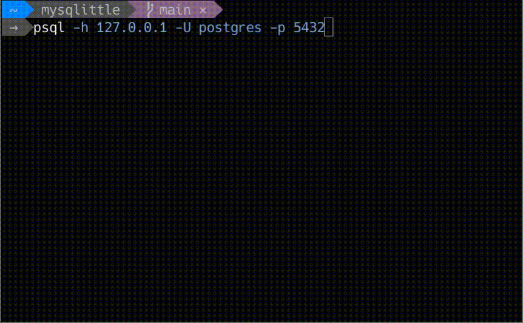

# PSQLittle

PSQLittle is a yet another RDBMS compatible with PostgreSQL.
This is for me to study RDBMS.



```bash
git clone https://github.com/goropikari/psqlittle.git
cd psqlittle
docker build -t psqlittle .
docker run -it -p 15432:5432 psqlittle  # server mode
psql -h 127.0.0.1 -p 15432  # connect dbms by using psql

docker run -it psqlittle repl  # repl mode
```
